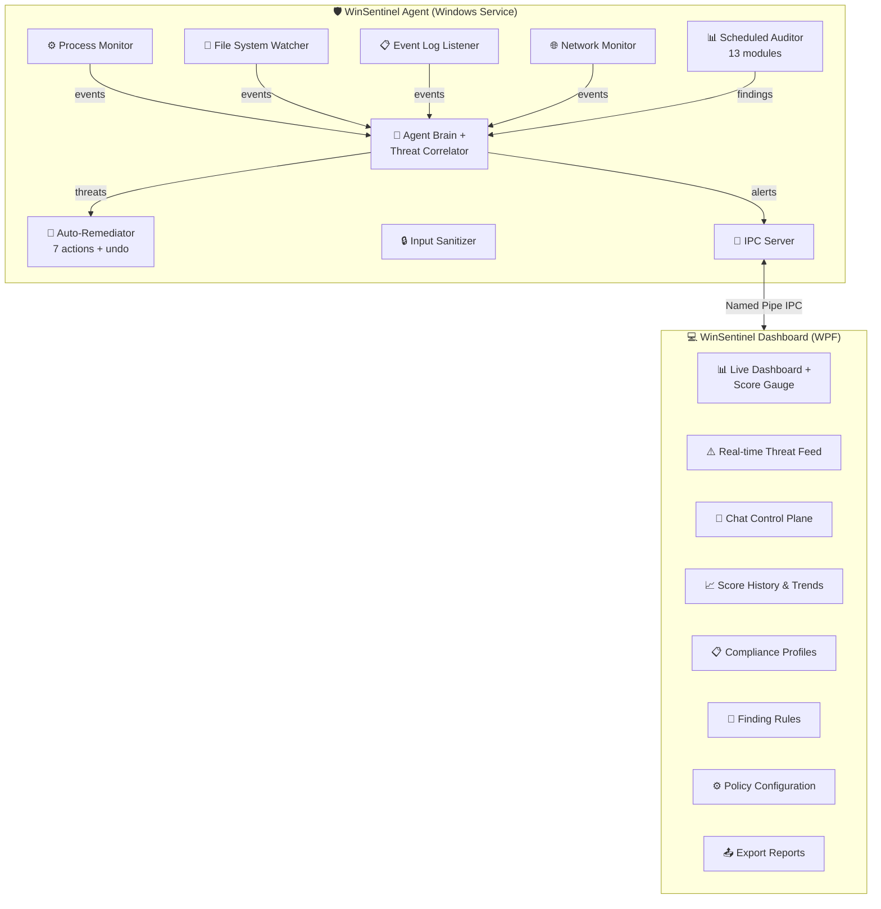
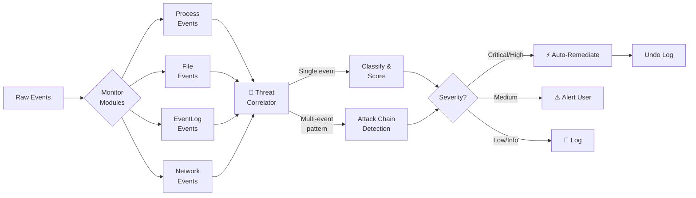

<div align="center">

# 🛡️ WinSentinel

### Your Always-On Windows Security Agent

[](https://github.com/sauravbhattacharya001/WinSentinel/actions/workflows/build.yml)
[](https://github.com/sauravbhattacharya001/WinSentinel/actions/workflows/codeql.yml)
[](https://codecov.io/gh/sauravbhattacharya001/WinSentinel)
[](https://www.nuget.org/packages/WinSentinel.Core)
[](https://github.com/sauravbhattacharya001/WinSentinel/releases)
[](https://github.com/sauravbhattacharya001/WinSentinel/pkgs/container/winsentinel)
[](https://dotnet.microsoft.com/)
[](https://www.microsoft.com/windows)
[](LICENSE)
[]()
[]()

**Not just an auditor — a living agent that monitors, detects, correlates, and responds 24/7.**

*Real-time threat detection • 13 audit modules • Auto-remediation • Chat control plane • AI-powered correlation • Compliance profiles*

[🚀 Quick Start](#-quick-start) · [📦 Install](#-installation) · [📖 Docs](https://sauravbhattacharya001.github.io/WinSentinel/) · [🐛 Issues](https://github.com/sauravbhattacharya001/WinSentinel/issues) · [📋 Changelog](#-releases)

---

</div>

## Why WinSentinel?

Most Windows security tools run once and give you a report. WinSentinel is different:

- **Always on** — runs as a Windows Service, monitoring your system 24/7
- **Correlates events** — doesn't just flag individual events, it detects multi-stage attack patterns
- **Takes action** — auto-remediates threats with full undo support
- **Speaks your language** — chat-based control plane with 25+ commands plus natural language
- **Compliance-aware** — built-in profiles for Home, Enterprise, HIPAA, PCI-DSS, and CIS L1
- **Deeply tested** — 1,172 automated tests across 49 test files

---

## 🏗️ Architecture

Two-process design: a background agent (Windows Service) and a WPF dashboard connected via named pipe IPC.



### Threat Detection Flow



The agent runs continuously — even with the dashboard closed — watching processes, file changes, event logs, and network activity. When it detects suspicious behavior, it correlates events, classifies threats, and auto-remediates based on configurable policies.

---

## ⚡ Features at a Glance

| Category | What You Get |
|:---|:---|
| 🔍 **4 Real-Time Monitors** | Process creation/termination, file system changes, Windows Event Log, network connections — always watching |
| 🧠 **AI-Powered Brain** | Correlates individual events into attack chains. Detects multi-stage attacks that single-event analysis misses |
| 🔧 **7 Auto-Remediation Actions** | Kill process, quarantine file, block IP, disable account, restore hosts, re-enable Defender, revert registry — **all with undo** |
| 💬 **Chat Control Plane** | 25+ commands plus natural language. Run audits, query threats, configure policies — from the chat panel |
| 📊 **13 Audit Modules** | Firewall, Updates, Defender, Accounts, Network, Processes, Startup, System, Privacy, Browser, App Security, Encryption, Event Log |
| 📋 **Compliance Profiles** | Home, Enterprise, HIPAA, PCI-DSS, CIS L1 — context-aware scoring with per-profile severity adjustments |
| 🔕 **Finding Suppression** | Ignore/suppress known-acceptable findings with regex rules, expiration dates, and audit trail |
| 📈 **Score History** | SQLite-backed audit tracking with trends. See your security posture change over time |
| 📤 **Export Reports** | HTML, JSON, Text, Markdown — save and share results |
| 🔔 **Toast Notifications** | Critical finding alerts via Windows notification center |
| 💻 **CLI Mode** | Full CLI (`winsentinel.exe`) for scripting, automation, and CI/CD gate checks |
| ⚙️ **System Tray** | Minimize to tray and run silently in the background |
| 🛡️ **Input Sanitization** | Centralized security layer prevents command injection in all user-facing inputs |

---

## 📸 Sample Audit Output

```
╔══════════════════════════════════════════════════════╗
║           WinSentinel Security Audit Report          ║
║              2026-02-21 22:35:00 PST                 ║
║           Profile: Enterprise                        ║
╠══════════════════════════════════════════════════════╣
║                                                      ║
║         Security Score:  92 / 100   Grade: A         ║
║         ████████████████████████████████░░  92%       ║
║                                                      ║
╠══════════════════════════════════════════════════════╣
║  Module           Score   Status                     ║
╠══════════════════════════════════════════════════════╣
║  🔥 Firewall       100    ██████████  PASS           ║
║  🔄 Updates          95    █████████░  PASS           ║
║  🛡️ Defender        100    ██████████  PASS           ║
║  👤 Accounts        100    ██████████  PASS           ║
║  🌐 Network          90    █████████░  PASS           ║
║  ⚙️ Processes        90    █████████░  PASS           ║
║  🚀 Startup          95    █████████░  PASS           ║
║  💻 System          100    ██████████  PASS           ║
║  🔒 Privacy          95    █████████░  PASS           ║
║  🌍 Browser          85    ████████░░  PASS           ║
║  📦 App Security     90    █████████░  PASS           ║
║  🔐 Encryption       80    ████████░░  WARN           ║
║  📋 Event Log        85    ████████░░  PASS           ║
╠══════════════════════════════════════════════════════╣
║  Findings: 65 total | 0 critical | 5 warnings       ║
║  Suppressed: 2 (accepted risk)                       ║
╚══════════════════════════════════════════════════════╝
```

---

## 🚀 Quick Start

### Prerequisites

- **Windows 10 or 11** (x64)
- [**.NET 8 SDK**](https://dotnet.microsoft.com/download/dotnet/8.0) (for building from source)

### Clone, Build & Run

```bash
git clone https://github.com/sauravbhattacharya001/WinSentinel.git
cd WinSentinel

# Build
dotnet build WinSentinel.sln -p:Platform=x64

# Run the dashboard
dotnet run --project src/WinSentinel.App -p:Platform=x64

# Run tests (1,172 tests)
dotnet test -p:Platform=x64
```

### Quick Audit (no build needed)

```powershell
.\RunAudit.ps1
```

---

## 📦 Installation

### Option 1: MSIX Installer

```powershell
# Downloads cert, installs MSIX — one command
.\Install-WinSentinel.ps1
```

### Option 2: Windows Service

```powershell
dotnet build src/WinSentinel.Agent -c Release

# Install (requires Administrator)
.\Install-Agent.ps1 -Install

# Check status
.\Install-Agent.ps1 -Status
```

### Option 3: Build MSIX from Source

```powershell
cd src\WinSentinel.Installer
.\Build-Msix.ps1
# → dist\WinSentinel.msix
```

---

## 🔍 Real-Time Monitors

| Monitor | What It Watches | Key Detections |
|:---|:---|:---|
| ⚙️ **Process** | Process creation & termination | Suspicious executables, unsigned binaries, temp/download path launches, known-bad names |
| 📁 **File System** | File create/modify/delete/rename | System directory changes, hosts file tampering, startup folder modifications, suspicious DLLs |
| 📋 **Event Log** | Windows Security & System logs | Failed logons, privilege escalation, audit policy changes, service installations, account modifications |
| 🌐 **Network** | Active connections & listening ports | New listeners, known-bad IPs, unusual outbound ports, DNS anomalies |

---

## 📊 The 13 Audit Modules

| # | Module | What It Scans |
|:---:|:---|:---|
| 1 | 🔥 **Firewall** | All profile states, rule analysis, dangerous port exposure (RDP 3389, SMB 445, Telnet 23) |
| 2 | 🔄 **Updates** | Windows Update service, pending updates, last install date, update source config |
| 3 | 🛡️ **Defender** | Real-time protection, cloud protection, behavior monitoring, definition age, tamper protection |
| 4 | 👤 **Accounts** | Local users, admin audit, password policies, guest account, empty passwords |
| 5 | 🌐 **Network** | Open ports, SMB/RDP exposure, LLMNR/NetBIOS poisoning, Wi-Fi security, ARP, IPv6 |
| 6 | ⚙️ **Processes** | Unsigned executables, suspicious paths, high-privilege monitoring |
| 7 | 🚀 **Startup** | Startup programs, scheduled tasks, Run/RunOnce keys, service types |
| 8 | 💻 **System** | OS build, Secure Boot, BitLocker, UAC level, RDP config, DEP/NX |
| 9 | 🔒 **Privacy** | Telemetry, advertising ID, location tracking, clipboard sync, activity history |
| 10 | 🌍 **Browser** | Chrome/Edge settings, dangerous extensions, saved passwords, update status |
| 11 | 📦 **App Security** | Outdated software, EOL flagging, installed program analysis |
| 12 | 🔐 **Encryption** | BitLocker, EFS, certificate store, TPM status |
| 13 | 📋 **Event Log** | Failed logins, suspicious events, audit policy gaps |

---

## 📋 Compliance Profiles

Built-in profiles adjust severity weights and scoring for different security contexts:

| Profile | Target Environment | Key Adjustments |
|:---|:---|:---|
| 🏠 **Home** | Personal/home use | Relaxed — info-level items don't penalize |
| 🏢 **Enterprise** | Corporate workstations | Moderate — emphasizes patching, network, accounts |
| 🏥 **HIPAA** | Healthcare environments | Strict — encryption, audit logging, access control weighted heavily |
| 💳 **PCI-DSS** | Payment card processing | Strict — network segmentation, firewall, patching critical |
| 🔒 **CIS L1** | CIS Benchmarks Level 1 | Comprehensive — baseline security for all organizations |

Switch profiles via the dashboard or CLI to see how your system scores under different compliance frameworks.

---

## 🔧 Auto-Remediation

7 autonomous response actions, each with full undo:

| Action | What It Does | Reversible |
|:---|:---|:---:|
| Kill Process | Terminates suspicious process | — |
| Quarantine File | Moves to quarantine directory | ✅ |
| Block IP | Creates firewall block rule | ✅ |
| Disable Account | Disables compromised account | ✅ |
| Restore Hosts | Reverts hosts file to clean state | ✅ |
| Re-enable Defender | Turns real-time protection back on | — |
| Revert Registry | Undoes malicious registry changes | ✅ |

---

## 💬 Chat Control Plane

25+ commands plus natural language understanding:

```
> status                    # Agent uptime, active monitors
> threats                   # Recent threat events
> audit                     # Run full 13-module audit
> audit firewall            # Run specific module
> score                     # Current score and grade
> history                   # Score trend over time
> monitor status            # All 4 monitor states
> start monitor process     # Start specific monitor
> policy                    # Show current policies
> set risk tolerance high   # Adjust sensitivity
> quarantine                # List quarantined files
> undo <id>                 # Reverse a remediation action
> journal                   # Agent activity log
> export html               # Export report
> fix all                   # Auto-fix all fixable findings
```

Natural language works too:

```
> Why is my network score low?
> What's the most dangerous thing on my system?
> Show me failed login attempts from today
```

---

## 💻 CLI Reference

```powershell
# Full audit
winsentinel --audit

# JSON output for scripting
winsentinel --audit --json

# Specific modules only
winsentinel --audit --modules firewall,network,privacy

# CI/CD gate: fail if score < 90
winsentinel --audit --threshold 90

# Auto-fix everything
winsentinel --fix-all

# Compare last two runs
winsentinel --history --compare

# Show what changed
winsentinel --history --diff
```

| Flag | Description |
|:---|:---|
| `--audit` | Run full security audit |
| `--score` | Print score and grade only |
| `--fix-all` | Auto-fix all fixable findings |
| `--history` | View past audit runs |
| `--json` / `--html` / `--md` | Output format |
| `--output <file>` | Save to file |
| `--modules <list>` | Comma-separated module list |
| `--threshold <n>` | Fail if score below n |
| `--compare` / `--diff` | Compare runs or show deltas |
| `--summary` | Executive security summary (plain-English brief) |
| `--quiet` | Score + exit code only |

**Exit codes:** `0` = pass, `1` = warnings, `2` = critical, `3` = error

---

## 📊 Scoring

Starts at 100, deductions by severity:

| Severity | Deduction | Example |
|:---:|:---:|:---|
| 🔴 Critical | -15 pts | Real-time protection disabled, firewall off |
| 🟡 Warning | -5 pts | LLMNR enabled, outdated definitions |
| 🔵 Info | -1 pt | Telemetry at default level |
| ✅ Pass | 0 pts | Secure Boot enabled, UAC on |

**Grades:** A+ (95+) · A (90-94) · B (80-89) · C (70-79) · D (60-69) · F (<60)

Compliance profiles adjust these weights contextually — a finding that's info-level for Home use might be a warning under HIPAA.

---

## 🏗️ Project Structure

```
WinSentinel.sln
├── src/
│   ├── WinSentinel.Core/          # Security audit engine (13 modules)
│   │   ├── Audits/                # Firewall, Network, Defender, etc.
│   │   ├── Models/                # AuditResult, Finding, SecurityReport
│   │   ├── Services/              # AuditEngine, Orchestrator, Scorer
│   │   └── Helpers/               # Shell, PowerShell, Registry, WMI
│   │
│   ├── WinSentinel.Agent/         # Always-on agent (Windows Service)
│   │   ├── Modules/               # 4 real-time monitors
│   │   ├── Services/              # Brain, Correlator, Remediator, Chat
│   │   │                          # Journal, Policy, IPC, Sanitizer
│   │   └── Ipc/                   # Named pipe protocol
│   │
│   ├── WinSentinel.App/           # WPF dashboard (MVVM)
│   │   ├── Views/                 # Dashboard, Chat, Policy, Compliance
│   │   ├── ViewModels/            # CommunityToolkit.Mvvm
│   │   └── Services/              # IPC client, ChatAI
│   │
│   ├── WinSentinel.Cli/           # Command-line interface
│   └── WinSentinel.Installer/     # MSIX packaging
│
├── tests/
│   └── WinSentinel.Tests/         # 1,172 xUnit tests (49 files)
│
├── RunAudit.ps1                   # Quick audit script
├── Install-Agent.ps1              # Service installer
├── Install-WinSentinel.ps1        # MSIX installer
└── Fix-Network.ps1                # Network security fix script
```

**By the numbers:** 27k+ lines of source code, 11k+ lines of tests, 59 commits, 49 test files.

---

## ⚙️ Tech Stack

| Component | Technology |
|:---|:---|
| Runtime | .NET 8 (LTS) |
| UI | WPF + MVVM (CommunityToolkit.Mvvm) |
| Language | C# 12 |
| Agent | Microsoft.Extensions.Hosting + Windows Services |
| IPC | Named Pipes (System.IO.Pipes) |
| Database | SQLite (Microsoft.Data.Sqlite) |
| Testing | xUnit — 1,172 tests |
| Security | CodeQL scanning, input sanitization |
| Packaging | MSIX with code signing |
| CI/CD | GitHub Actions (build, test, release, CodeQL) |
| AI | Ollama (local LLM) + built-in rule engine |

---

## 📋 Releases

| Version | Date | Highlights |
|:---|:---|:---|
| [**v1.1.0**](https://github.com/sauravbhattacharya001/WinSentinel/releases/tag/v1.1.0) | 2026-02-20 | Compliance profiles (Home/Enterprise/HIPAA/PCI-DSS/CIS L1), finding ignore/suppress rules, remediation checklists, baseline snapshots |
| [**v1.0.0**](https://github.com/sauravbhattacharya001/WinSentinel/releases/tag/v1.0.0) | 2026-02-17 | Always-on agent, 4 real-time monitors, AI brain + correlator, auto-remediation, chat control plane, 13 audit modules, CLI, MSIX installer |

---

## 🤝 Contributing

1. **Fork** the repository
2. **Create** a feature branch (`git checkout -b feature/amazing-feature`)
3. **Test** your changes (`dotnet test -p:Platform=x64`)
4. **Push** and open a Pull Request

**Ideas:** plugin system for custom modules, Linux port, UI themes, localization, additional compliance profiles.

---

## 📄 License

MIT License — see [LICENSE](LICENSE) for details.

---

<div align="center">

**Built with C# on .NET 8 · 27k+ LOC · 1,172 tests · Always watching 🛡️**

[⭐ Star](https://github.com/sauravbhattacharya001/WinSentinel) · [🐛 Report Bug](https://github.com/sauravbhattacharya001/WinSentinel/issues) · [💡 Request Feature](https://github.com/sauravbhattacharya001/WinSentinel/issues)

</div>
