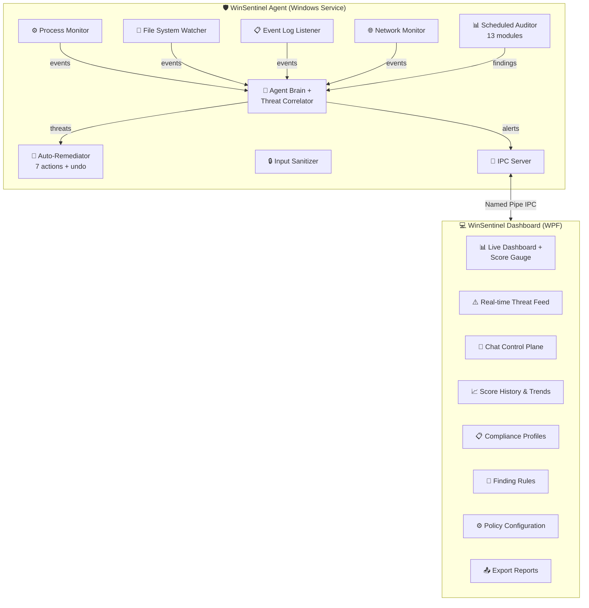
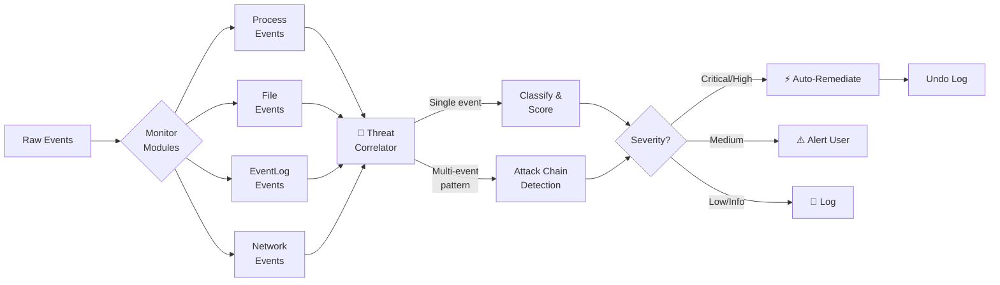

<div align="center">

# 🛡️ WinSentinel

### Your Always-On Windows Security Agent

[](https://github.com/sauravbhattacharya001/WinSentinel/actions/workflows/build.yml)
[](https://github.com/sauravbhattacharya001/WinSentinel/actions/workflows/codeql.yml)
[](https://codecov.io/gh/sauravbhattacharya001/WinSentinel)
[](https://www.nuget.org/packages/WinSentinel.Core)
[](https://github.com/sauravbhattacharya001/WinSentinel/releases)
[](https://github.com/sauravbhattacharya001/WinSentinel/pkgs/container/winsentinel)
[](https://dotnet.microsoft.com/)
[](https://www.microsoft.com/windows)
[](LICENSE)
[]()
[]()

**Not just an auditor - a living agent that monitors, detects, correlates, and responds 24/7.**

*Real-time threat detection • 34 audit modules • Auto-remediation • Chat control plane • AI-powered correlation • Compliance profiles • Plugin system*

[🚀 Quick Start](#-quick-start) · [📦 Install](#-installation) · [📖 Docs](https://docs.winsentinel.ai) · [🐛 Issues](https://github.com/sauravbhattacharya001/WinSentinel/issues) · [📋 Changelog](https://winsentinel.ai/changelog)

---

</div>

## Why WinSentinel?

Most Windows security tools run once and give you a report. WinSentinel is different:

- **Always on** - runs as a Windows Service, monitoring your system 24/7
- **Correlates events** - doesn't just flag individual events, it detects multi-stage attack patterns
- **Takes action** - auto-remediates threats with full undo support
- **Speaks your language** - chat-based control plane with 25+ commands plus natural language
- **Compliance-aware** - built-in profiles for Home, Enterprise, HIPAA, PCI-DSS, and CIS L1
- **Deeply tested** - 5,376 automated tests across 188 test files
- **Extensible** - plugin architecture with Ed25519-signed community modules

---

## 🏗️ Architecture

Two-process design: a background agent (Windows Service) and a WPF dashboard connected via named pipe IPC.



### Threat Detection Flow



The agent runs continuously - even with the dashboard closed - watching processes, file changes, event logs, and network activity. When it detects suspicious behavior, it correlates events, classifies threats, and auto-remediates based on configurable policies.

---

## ⚡ Features at a Glance

| Category | What You Get |
|:---|:---|
| 🔍 **4 Real-Time Monitors** | Process creation/termination, file system changes, Windows Event Log, network connections - always watching |
| 🧠 **AI-Powered Brain** | Correlates individual events into attack chains. Detects multi-stage attacks that single-event analysis misses |
| 🔧 **7 Auto-Remediation Actions** | Kill process, quarantine file, block IP, disable account, restore hosts, re-enable Defender, revert registry - **all with undo** |
| 💬 **Chat Control Plane** | 25+ commands plus natural language. Run audits, query threats, configure policies - from the chat panel |
| 📊 **34 Audit Modules** | Firewall, Updates, Defender, Accounts, Network, Processes, Startup, System, Privacy, Browser, App Security, Encryption, Event Log, Identity & Credentials, PowerShell, USB/Removable Media, DNS, Drivers, Certificates, Remote Access, and 14 more |
| 📋 **Compliance Profiles** | Home, Enterprise, HIPAA, PCI-DSS, CIS L1 - context-aware scoring with per-profile severity adjustments |
| 🔕 **Finding Suppression** | Ignore/suppress known-acceptable findings with regex rules, expiration dates, and audit trail |
| 📈 **Score History** | SQLite-backed audit tracking with trends, heatmaps, and regression detection |
| 📤 **Export Reports** | HTML, JSON, CSV, SARIF, Text, Markdown - save and share results |
| 🔔 **Toast Notifications** | Critical finding alerts via Windows notification center |
| 💻 **CLI Mode** | Full CLI with 50+ subcommands for scripting, automation, and CI/CD gate checks |
| 🔌 **Plugin System** | Ed25519-signed community plugins with multi-publisher trust model |
| 🎯 **GitHub Action** | Marketplace action for automated security auditing in CI/CD |
| ⚙️ **System Tray** | Minimize to tray and run silently in the background |
| 🛡️ **Input Sanitization** | Centralized security layer prevents command injection in all user-facing inputs |

---

## 📸 Sample Audit Output

```
╔══════════════════════════════════════════════════════╗
║           WinSentinel Security Audit Report          ║
║              2026-02-21 22:35:00 PST                 ║
║           Profile: Enterprise                        ║
╠══════════════════════════════════════════════════════╣
║                                                      ║
║         Security Score:  92 / 100   Grade: A         ║
║         ████████████████████████████████░░  92%       ║
║                                                      ║
╠══════════════════════════════════════════════════════╣
║  Module           Score   Status                     ║
╠══════════════════════════════════════════════════════╣
║  🔥 Firewall       100    ██████████  PASS           ║
║  🔄 Updates          95    █████████░  PASS           ║
║  🛡️ Defender        100    ██████████  PASS           ║
║  👤 Accounts        100    ██████████  PASS           ║
║  🌐 Network          90    █████████░  PASS           ║
║  ⚙️ Processes        90    █████████░  PASS           ║
║  🚀 Startup          95    █████████░  PASS           ║
║  💻 System          100    ██████████  PASS           ║
║  🔒 Privacy          95    █████████░  PASS           ║
║  🌍 Browser          85    ████████░░  PASS           ║
║  📦 App Security     90    █████████░  PASS           ║
║  🔐 Encryption       80    ████████░░  WARN           ║
║  📋 Event Log        85    ████████░░  PASS           ║
║  🔑 Identity         90    █████████░  PASS           ║
║  ⚡ PowerShell       85    ████████░░  PASS           ║
║  🔌 USB              95    █████████░  PASS           ║
║  ... +17 more modules                              ║
╠══════════════════════════════════════════════════════╣
║  Findings: 65 total | 0 critical | 5 warnings       ║
║  Suppressed: 2 (accepted risk)                       ║
║  Modules scanned: 34                                 ║
╚══════════════════════════════════════════════════════╝
```

---

## 🚀 Quick Start

### Prerequisites

- **Windows 10 or 11** (x64)
- [**.NET 8 SDK**](https://dotnet.microsoft.com/download/dotnet/8.0) (for building from source)

### Clone, Build & Run

```bash
git clone https://github.com/sauravbhattacharya001/WinSentinel.git
cd WinSentinel

# Build
dotnet build WinSentinel.sln -p:Platform=x64

# Run the dashboard
dotnet run --project src/WinSentinel.App -p:Platform=x64

# Run tests (4,173 tests)
dotnet test -p:Platform=x64
```

### Quick Audit (no build needed)

```powershell
.\RunAudit.ps1
```

---

## 📦 Installation

### Option 1: .NET Global Tool (Recommended)

```powershell
dotnet tool install --global WinSentinel.Cli
winsentinel --audit
```

### Option 2: WinGet (Windows Package Manager)

```powershell
winget install SauravBhattacharya.WinSentinel
```

### Option 3: MSIX Installer

```powershell
# Downloads cert, installs MSIX - one command
.\Install-WinSentinel.ps1
```

### Option 4: Windows Service

```powershell
dotnet build src/WinSentinel.Agent -c Release

# Install (requires Administrator)
.\Install-Agent.ps1 -Install

# Check status
.\Install-Agent.ps1 -Status
```

### Option 5: Build MSIX from Source

```powershell
cd src\WinSentinel.Installer
.\Build-Msix.ps1
# → dist\WinSentinel.msix
```

---

## 🔍 Real-Time Monitors

| Monitor | What It Watches | Key Detections |
|:---|:---|:---|
| ⚙️ **Process** | Process creation & termination | Suspicious executables, unsigned binaries, temp/download path launches, known-bad names |
| 📁 **File System** | File create/modify/delete/rename | System directory changes, hosts file tampering, startup folder modifications, suspicious DLLs |
| 📋 **Event Log** | Windows Security & System logs | Failed logons, privilege escalation, audit policy changes, service installations, account modifications |
| 🌐 **Network** | Active connections & listening ports | New listeners, known-bad IPs, unusual outbound ports, DNS anomalies |

---

## 📊 The 34 Audit Modules

| # | Module | What It Scans |
|:---:|:---|:---|
| 1 | 🔥 **Firewall** | All profile states, rule analysis, dangerous port exposure (RDP 3389, SMB 445, Telnet 23) |
| 2 | 🔄 **Updates** | Windows Update service, pending updates, last install date, update source config |
| 3 | 🛡️ **Defender** | Real-time protection, cloud protection, behavior monitoring, definition age, tamper protection, Attack Surface Reduction (ASR) rules |
| 4 | 👤 **Accounts** | Local users, admin audit, password policies, guest account, empty passwords |
| 5 | 🌐 **Network** | Open ports, SMB/RDP exposure, LLMNR/NetBIOS poisoning, Wi-Fi security, ARP, IPv6 |
| 6 | ⚙️ **Processes** | Unsigned executables, suspicious paths, high-privilege monitoring |
| 7 | 🚀 **Startup** | Startup programs, scheduled tasks, Run/RunOnce keys, service types |
| 8 | 💻 **System** | OS build, Secure Boot, BitLocker, UAC level, RDP config, DEP/NX |
| 9 | 🔒 **Privacy** | Telemetry, advertising ID, location tracking, clipboard sync, activity history |
| 10 | 🌍 **Browser** | Chrome/Edge extensions audit, password autofill posture, weak cert pins |
| 11 | 📦 **App Security** | Outdated software, known-vulnerable packages, sideloaded MSIX/AppX |
| 12 | 🔐 **Encryption** | BitLocker per volume, TPM 2.0, EFS coverage, expired certs, weak RSA keys |
| 13 | 📋 **Event Log** | Failed logons, privilege escalations, service installations, suspicious PowerShell |
| 14 | 🔑 **Identity & Credentials** | Local admin sprawl, stale accounts, LAPS posture, cached credentials |
| 15 | ⚡ **PowerShell** | Execution policy, transcription/module logging, AMSI, ConstrainedLanguageMode |
| 16 | 🔌 **USB & Removable Media** | Device history, autorun status, BitLocker-to-Go, write-protect policy |
| 17 | 🌐 **DNS** | DNS-over-HTTPS config, cache poisoning vectors, resolver security |
| 18 | 🖥️ **Drivers** | Unsigned drivers, vulnerable driver blocklist, kernel-mode code integrity |
| 19 | 📜 **Certificates** | Store audit, expired/weak certs, untrusted roots, chain validation |
| 20 | 🔗 **Remote Access** | RDP security, remote management exposure, WinRM config |
| 21 | 📡 **Bluetooth** | Discoverable mode, paired devices, BLE security posture |
| 22 | 🗂️ **Registry** | Security-sensitive keys, tampered values, autostart persistence |
| 23 | 🌍 **Environment** | PATH injection risks, dangerous environment variables, temp permissions |
| 24 | 💾 **Backup** | System Restore points, backup schedule, recovery partition health |
| 25 | 📋 **Group Policy** | Applied GPOs, security-relevant policies, drift from baselines |
| 26 | 📂 **SMB Shares** | Exposed shares, anonymous access, SMBv1 status, signing requirements |
| 27 | ⏰ **Scheduled Tasks** | Suspicious tasks, unsigned executables, persistence mechanisms |
| 28 | ⚙️ **Services** | Unquoted service paths, weak permissions, service account audit |
| 29 | 📦 **Software Inventory** | Installed applications, version status, EOL detection |
| 30 | 📶 **Wi-Fi** | Saved profiles, WPA/WPA2/WPA3 status, open network warnings |
| 31 | 🖥️ **Virtualization** | Hyper-V, VBS, Credential Guard, hypervisor code integrity |
| 32 | 🔍 **Process Lineage** | Parent-child relationships, suspicious spawn patterns, LOTL detection |
| 33 | 🕵️ **Credential Exposure** | Credential caching, NTLM exposure, Mimikatz-harvestable secrets |
| 34 | 📝 **Audit Policy** | Windows audit configuration gaps, recommended logging settings |

---

## 📋 Compliance Profiles

Built-in profiles adjust severity weights and scoring for different security contexts:

| Profile | Target Environment | Key Adjustments |
|:---|:---|:---|
| 🏠 **Home** | Personal/home use | Relaxed - info-level items don't penalize |
| 🏢 **Enterprise** | Corporate workstations | Moderate - emphasizes patching, network, accounts |
| 🏥 **HIPAA** | Healthcare environments | Strict - encryption, audit logging, access control weighted heavily |
| 💳 **PCI-DSS** | Payment card processing | Strict - network segmentation, firewall, patching critical |
| 🔒 **CIS L1** | CIS Benchmarks Level 1 | Comprehensive - baseline security for all organizations |

Switch profiles via the dashboard or CLI to see how your system scores under different compliance frameworks.

---

## 🔧 Auto-Remediation

7 autonomous response actions, each with full undo:

| Action | What It Does | Reversible |
|:---|:---|:---:|
| Kill Process | Terminates suspicious process | - |
| Quarantine File | Moves to quarantine directory | ✅ |
| Block IP | Creates firewall block rule | ✅ |
| Disable Account | Disables compromised account | ✅ |
| Restore Hosts | Reverts hosts file to clean state | ✅ |
| Re-enable Defender | Turns real-time protection back on | - |
| Revert Registry | Undoes malicious registry changes | ✅ |

---

## 💬 Chat Control Plane

25+ commands plus natural language understanding:

```
> status                    # Agent uptime, active monitors
> threats                   # Recent threat events
> audit                     # Run full 34-module audit
> audit firewall            # Run specific module
> score                     # Current score and grade
> history                   # Score trend over time
> monitor status            # All 4 monitor states
> start monitor process     # Start specific monitor
> policy                    # Show current policies
> set risk tolerance high   # Adjust sensitivity
> quarantine                # List quarantined files
> undo <id>                 # Reverse a remediation action
> journal                   # Agent activity log
> export html               # Export report
> fix all                   # Auto-fix all fixable findings
```

Natural language works too:

```
> Why is my network score low?
> What's the most dangerous thing on my system?
> Show me failed login attempts from today
```

---

## 💻 CLI Reference

```powershell
# Full audit
winsentinel --audit

# JSON output for scripting
winsentinel --audit --json

# Specific modules only
winsentinel --audit --modules firewall,network,privacy

# CI/CD gate: fail if score < 90
winsentinel --audit --threshold 90

# Auto-fix everything
winsentinel --fix-all

# Compare runs / show delta
winsentinel diff
winsentinel diff <run-id>

# Live watch mode (re-audits on interval)
winsentinel watch --interval 300

# Explain a finding
winsentinel why "LLMNR enabled"

# Export in any format
winsentinel export json                              # Positional
winsentinel export --json                            # Or as a flag
winsentinel export --sarif -o findings.sarif         # SARIF for GitHub Code Scanning
winsentinel export --csv -o report.csv               # CSV for spreadsheets
winsentinel export --markdown -o report.md           # Markdown for issue trackers
winsentinel export                                   # No args => defaults to JSON on stdout

# Manage ignored findings
winsentinel ignore add --pattern "telemetry" --reason "accepted risk"
winsentinel ignore list
winsentinel ignore rm <rule-id>

# Self-update from NuGet
winsentinel self-update
winsentinel self-update --check

# Agent daemon
winsentinel agent start
winsentinel agent status
winsentinel agent install   # as Windows Service

# Fleet management (Pro)
winsentinel fleet status
winsentinel fleet scan-all
winsentinel fleet push-policy --file policy.json

# Plugin management
winsentinel plugin list
winsentinel plugin trust <publisher-key>
```

| Flag / Command | Description |
|:---|:---|
| `--audit` | Run full security audit |
| `--score` | Print score and grade only |
| `--fix-all` | Auto-fix all fixable findings |
| `--history` | View past audit runs |
| `--json` / `--html` / `--md` / `--csv` / `--sarif` | Output format |
| `--output <file>` | Save to file |
| `--modules <list>` | Comma-separated module list |
| `--threshold <n>` | Fail if score below n |
| `--compare` / `--diff` | Compare runs or show deltas |
| `--summary` | Executive security summary |
| `--quiet` | Score + exit code only |
| `diff [run-id]` | Show what changed between scans |
| `watch` | Continuous monitoring with alerts |
| `why <finding>` | Explain why a finding matters |
| `export <format>` | Export results (json, csv, sarif, markdown) |
| `ignore add/list/rm` | Manage finding suppression rules |
| `self-update` | Update CLI from NuGet |
| `agent start/stop/status/install` | Manage the background agent |
| `fleet status/scan-all/push-policy` | Fleet orchestration (Pro) |
| `plugin list/trust/untrust` | Manage community plugins |
| `telemetry enable/disable/status` | Anonymous usage telemetry |

**Exit codes:** `0` = pass, `1` = warnings, `2` = critical, `3` = error

---

## 📊 Scoring

Starts at 100, deductions by severity:

| Severity | Deduction | Example |
|:---:|:---:|:---|
| 🔴 Critical | -15 pts | Real-time protection disabled, firewall off |
| 🟡 Warning | -5 pts | LLMNR enabled, outdated definitions |
| 🔵 Info | -1 pt | Telemetry at default level |
| ✅ Pass | 0 pts | Secure Boot enabled, UAC on |

**Grades:** A+ (95+) · A (90-94) · B (80-89) · C (70-79) · D (60-69) · F (<60)

Compliance profiles adjust these weights contextually - a finding that's info-level for Home use might be a warning under HIPAA.

---

## 🏗️ Project Structure

```
WinSentinel.sln
├── src/
│   ├── WinSentinel.Core/          # Security audit engine (34 modules)
│   │   ├── Audits/                # Firewall, Network, Defender, Identity, etc.
│   │   ├── Models/                # AuditResult, Finding, SecurityReport
│   │   ├── Services/              # AuditEngine, Orchestrator, Scorer
│   │   ├── Plugins/               # Plugin host, Ed25519 verification
│   │   └── Helpers/               # Shell, PowerShell, Registry, WMI
│   │
│   ├── WinSentinel.Agent/         # Always-on agent (Windows Service)
│   │   ├── Modules/               # 4 real-time monitors
│   │   ├── Services/              # Brain, Correlator, Remediator, Chat
│   │   │                          # Journal, Policy, IPC, Sanitizer
│   │   └── Ipc/                   # Named pipe protocol
│   │
│   ├── WinSentinel.App/           # WPF dashboard (MVVM)
│   │   ├── Views/                 # Dashboard, Chat, Policy, Compliance
│   │   ├── ViewModels/            # CommunityToolkit.Mvvm
│   │   └── Services/              # IPC client, ChatAI
│   │
│   ├── WinSentinel.Cli/           # Command-line interface (50+ commands)
│   ├── WinSentinel.Service/       # Service host
│   └── WinSentinel.Installer/     # MSIX packaging
│
├── action/                         # GitHub Action for CI security audits
├── tests/
│   └── WinSentinel.Tests/         # 5,376 xUnit tests (188 files)
│
├── docfx/                          # Documentation site source
├── winget/                         # WinGet manifest templates
├── RunAudit.ps1                   # Quick audit script
├── Install-Agent.ps1              # Service installer
├── Install-WinSentinel.ps1        # MSIX installer
└── Fix-Network.ps1                # Network security fix script
```

**By the numbers:** 111k+ lines of source code, 67k+ lines of tests, 560+ commits, 188 test files.

---

## ⚙️ Tech Stack

| Component | Technology |
|:---|:---|
| Runtime | .NET 8 (LTS) |
| UI | WPF + MVVM (CommunityToolkit.Mvvm) |
| Language | C# 12 |
| Agent | Microsoft.Extensions.Hosting + Windows Services |
| IPC | Named Pipes (System.IO.Pipes) |
| Database | SQLite (Microsoft.Data.Sqlite) |
| Testing | xUnit — 5,376 tests |
| Security | CodeQL scanning, input sanitization |
| Packaging | MSIX with code signing |
| CI/CD | GitHub Actions (build, test, release, CodeQL) |
| AI | Ollama (local LLM) + built-in rule engine |

---

## 📋 Releases

| Version | Date | Highlights |
|:---|:---|:---|
| [**v1.19.1**](https://github.com/sauravbhattacharya001/WinSentinel/releases/tag/v1.19.1) | 2026-06-01 | Plugin trust model, Ed25519 publisher key, CI hardening |
| [**v1.19.0**](https://github.com/sauravbhattacharya001/WinSentinel/releases/tag/v1.19.0) | 2026-05-31 | Plugin architecture, `self-update`, `export` subcommand, `pro activate` |
| [**v1.18.0**](https://github.com/sauravbhattacharya001/WinSentinel/releases/tag/v1.18.0) | 2026-05-27 | USB audit module, BVT gating, E2E smoke tests |
| [**v1.17.0**](https://github.com/sauravbhattacharya001/WinSentinel/releases/tag/v1.17.0) | 2026-05-26 | Test infrastructure, release prep, roadmap docs |
| [**v1.16.1**](https://github.com/sauravbhattacharya001/WinSentinel/releases/tag/v1.16.1) | 2026-05-24 | NuGet workflow fix, orphan process reaper |
| [**v1.16.0**](https://github.com/sauravbhattacharya001/WinSentinel/releases/tag/v1.16.0) | 2026-05-24 | Agentic advisors (ScheduledTask, Service, WMI, DLL hijack) |
| [**v1.15.1**](https://github.com/sauravbhattacharya001/WinSentinel/releases/tag/v1.15.1) | 2026-05-22 | Score history, heatmaps, regression predictor, burndown |
| [**v1.15.0**](https://github.com/sauravbhattacharya001/WinSentinel/releases/tag/v1.15.0) | 2026-05-21 | Watch mode, attack surface analyzer, grep, playbooks |
| [**v1.14.0**](https://github.com/sauravbhattacharya001/WinSentinel/releases/tag/v1.14.0) | 2026-05-20 | Gamification, habits, maturity model, noise reduction |
| [**v1.13.0**](https://github.com/sauravbhattacharya001/WinSentinel/releases/tag/v1.13.0) | 2026-05-18 | Risk matrix, coverage analysis, SLA tracking |
| [**v1.12.0**](https://github.com/sauravbhattacharya001/WinSentinel/releases/tag/v1.12.0) | 2026-05-16 | Hotspots, tags, dependency graph, timeline |
| [**v1.11.0**](https://github.com/sauravbhattacharya001/WinSentinel/releases/tag/v1.11.0) | 2026-05-14 | Compliance framework, benchmark, cost analysis, what-if |
| [**v1.4.0**](https://github.com/sauravbhattacharya001/WinSentinel/releases/tag/v1.4.0) | 2026-03-29 | Major feature release |
| [**v1.3.0**](https://github.com/sauravbhattacharya001/WinSentinel/releases/tag/v1.3.0) | 2026-03-20 | CLI power tools & hardened security |
| [**v1.2.0**](https://github.com/sauravbhattacharya001/WinSentinel/releases/tag/v1.2.0) | 2026-03-16 | Deep system auditing & threat intelligence |
| [**v1.1.0**](https://github.com/sauravbhattacharya001/WinSentinel/releases/tag/v1.1.0) | 2026-02-20 | Compliance profiles, finding suppression, remediation checklists |
| [**v1.0.0**](https://github.com/sauravbhattacharya001/WinSentinel/releases/tag/v1.0.0) | 2026-02-17 | Initial release — always-on agent, 4 monitors, AI correlator |

Full changelog at [winsentinel.ai/changelog](https://winsentinel.ai/changelog).

---

## 🔐 Security Model

WinSentinel follows a defense-in-depth approach:

| Layer | Protection |
|:---|:---|
| **Input Sanitization** | All user inputs (chat, CLI, config) pass through a centralized `InputSanitizer` that blocks command injection, path traversal, and control characters |
| **Least Privilege** | The dashboard runs as the current user. Only the agent service and remediation actions require Administrator |
| **Undo Journal** | Every auto-remediation action is logged with full undo metadata - quarantined files can be restored, blocked IPs unblocked, disabled accounts re-enabled |
| **Named Pipe IPC** | Dashboard↔Agent communication uses local-only named pipes (no network exposure). The pipe is ACL-restricted to the installing user and SYSTEM |
| **Finding Suppression Audit Trail** | When you suppress a finding, WinSentinel records who, when, why, and expiration - suppressions don't silently hide real threats |
| **No Outbound Telemetry (by default)** | WinSentinel sends zero data home unless you opt in via `winsentinel telemetry enable`. When opted in, reports are anonymous and stripped of PII. AI features use local Ollama models only |

> **Reporting vulnerabilities:** See [SECURITY.md](SECURITY.md) for responsible disclosure guidelines.

---

## ❓ Troubleshooting

<details>
<summary><strong>Agent service won't start</strong></summary>

1. Ensure you're running PowerShell as **Administrator**
2. Check .NET 8 is installed: `dotnet --list-runtimes`
3. Review Windows Event Viewer → Application log for `WinSentinel.Agent` errors
4. Try running the agent manually first: `dotnet run --project src/WinSentinel.Agent`

</details>

<details>
<summary><strong>Dashboard can't connect to agent</strong></summary>

1. Verify the agent service is running: `.\Install-Agent.ps1 -Status`
2. Named pipe connections require both processes to run under the same user (or SYSTEM)
3. Some antivirus software blocks named pipe creation - add an exclusion for `WinSentinel.Agent.exe`

</details>

<details>
<summary><strong>False positives in audit results</strong></summary>

1. Use **Finding Rules** in the dashboard to suppress known-acceptable findings
2. Switch to a more appropriate **Compliance Profile** (e.g., Home vs Enterprise)
3. Use `--modules` flag in CLI to skip irrelevant audit modules
4. Open an [issue](https://github.com/sauravbhattacharya001/WinSentinel/issues) if a detection rule is genuinely wrong

</details>

<details>
<summary><strong>Build fails on x86 or ARM</strong></summary>

WinSentinel targets **x64 only**. Always pass `-p:Platform=x64`:
```powershell
dotnet build WinSentinel.sln -p:Platform=x64
dotnet test -p:Platform=x64
```

</details>

<details>
<summary><strong>Network score seems wrong</strong></summary>

1. Run `.\Fix-Network.ps1` to apply recommended network hardening
2. Some findings (LLMNR, NetBIOS) require registry changes + reboot
3. VPN adapters can trigger false "open port" findings - suppress with Finding Rules

</details>

---

## 🤝 Contributing

1. **Fork** the repository
2. **Create** a feature branch (`git checkout -b feature/amazing-feature`)
3. **Test** your changes (`dotnet test -p:Platform=x64`)
4. **Push** and open a Pull Request

**Ideas:** Linux port, UI themes, localization, additional compliance profiles.

WinSentinel supports plugins for custom audit modules. Write your own security checks, share them with the community, or keep them private for your org's specific compliance needs. See [docs/CREATING-PLUGINS.md](docs/CREATING-PLUGINS.md) to build your own plugin.

### CI/CD Integration

Use the official [GitHub Action](https://github.com/sauravbhattacharya001/WinSentinel/tree/main/action) to run security audits in your CI pipeline:

```yaml
- uses: sauravbhattacharya001/WinSentinel@main
  with:
    fail-below: 85                         # fail the job if score < 85 (0 = never fail)
    modules: firewall,network,defender     # comma-separated; omit to run all modules
    sarif: true                            # upload results to GitHub Code Scanning
```

---

## 📄 License

MIT License - see [LICENSE](LICENSE) for details.

---

<div align="center">

**Built with C# on .NET 8 · 111k+ LOC · 5,376 tests · 34 audit modules · Always watching 🛡️**

[⭐ Star](https://github.com/sauravbhattacharya001/WinSentinel) · [🐛 Report Bug](https://github.com/sauravbhattacharya001/WinSentinel/issues) · [💡 Request Feature](https://github.com/sauravbhattacharya001/WinSentinel/issues)

</div>
